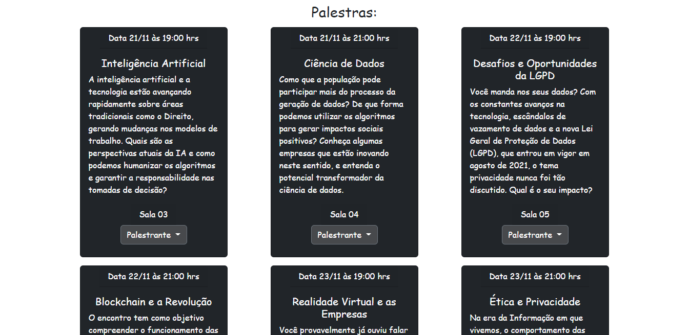
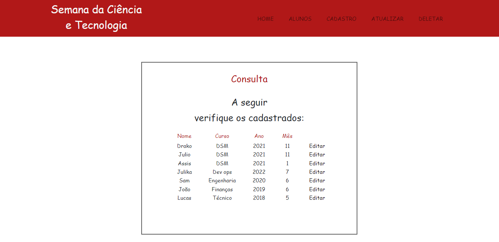
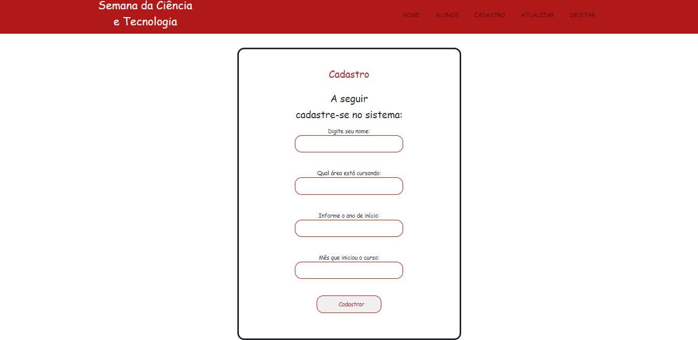

# FATEC_DES_WEB_3_2022_ProjetoAvaliacao

Construção de um sistema de cadastro de alunos (CRUD) utilizando a ferramenta Django.

## Getting Started

Podemos verificar abaixo a home deste projeto, em que podemos escolher qual opção desejamos do sistema:

* Criar um cadastro
* Rever informações
* Update de algum dado
* Deletar algum cadastro

Um pouco mais abaixo, há a descrição de palestras disponíveis em determinada semana, e ao clicar no botão
Palestrante, veremos o nome e as informações referente a este, como seu cargo atual e sua formação.
  

Escolhendo a opção Consultar alunos cadastrados ou Alunos (barra de navegação), teremos como resultado
a consulta das informações de alunos cadastrados no banco até aquele momento, sendo possível atualizar qualquer
cadastro, clicando no botão Editar ou Atualizar (barra de navegação).
  

A opção de Cadastrar aluno ou Cadastro (barra de navegação), somos direcionados a tela de cadastro, onde 
podemos adicionar novas informações ao sistema, para consulta posterior na tela de alunos cadastrados.

Por fim, escolhendo a opção Deletar registro ou Deletar (barra de navegação), temos acesso a tela de exclusão
de registros no sistema, onde podemos apagar o cadastro da linha escolhida, e na sequência o sistema irá atualizar
a informação em tempo real, retirando o registro excluído.

 

    
<h2> Desenvolvimento </h2>

    

