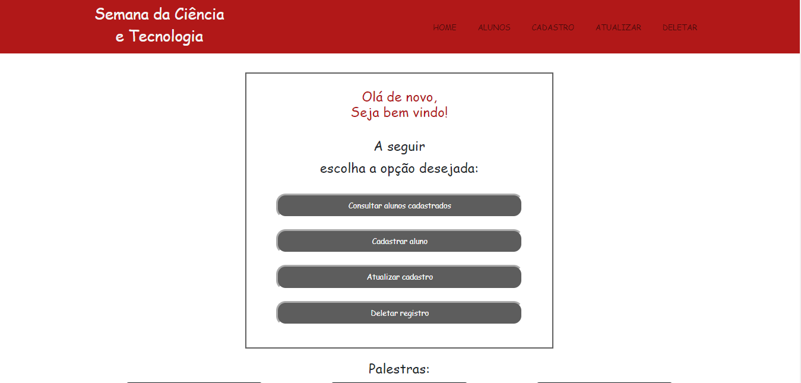

# FATEC_DES_WEB_3_2022_ProjetoAvaliacao

Construção de um sistema de cadastro de alunos (CRUD) utilizando a ferramenta Django.

## Getting Started

Podemos verificar abaixo a home deste projeto, em que podemos escolher qual opção desejamos do sistema:

### Criar 
um cadastro
### Rever 
informações
### Update 
de algum dado
### Deletar 
algum cadastro

